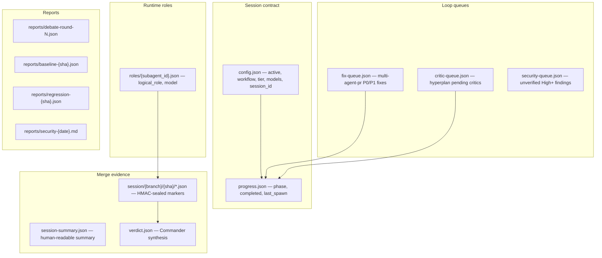
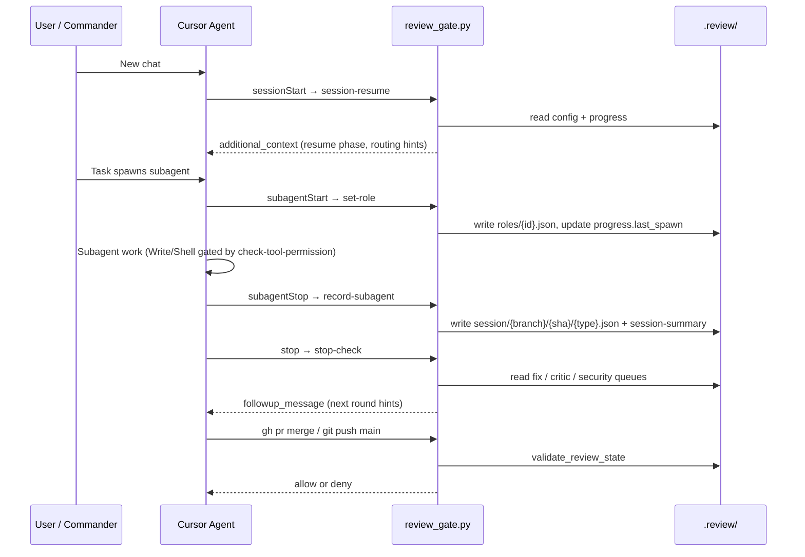
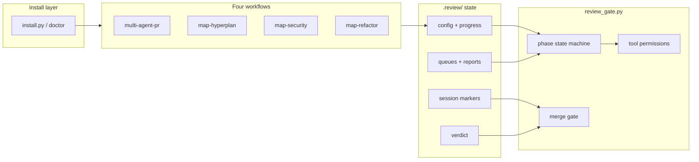

# oh-my-cursor

Independent, versioned **MAP (Multi-Agent Protocol)** engine for Cursor — hooks, skills, install tooling, and a fail-closed merge gate for multi-agent PR workflows.

[](https://github.com/tizerluo/oh-my-cursor/actions/workflows/ci.yml)

## Status

- **Version:** [v1.1](https://github.com/tizerluo/oh-my-cursor/releases/tag/v1.1) (see [CHANGELOG.md](CHANGELOG.md))
- **Spec:** [`.specs/oh-my-cursor.md`](.specs/oh-my-cursor.md) (accepted via map-hyperplan)
- **Tests:** 103+ via [`hooks/run_tests.sh`](hooks/run_tests.sh)
- **Live Spike:** Cursor 3.7.19+ — [docs/spike-verification.md](docs/spike-verification.md)

## What is MAP?

oh-my-cursor is the **engine package**. After install, it runs inside **consumer git repos** (your projects) via Cursor hooks:

```text
oh-my-cursor (this repo)              Consumer repo (your project)
├── hooks/review_gate.py   ─install─►  ~/.cursor/hooks/  or  repo/.cursor/hooks/
├── skills/*               ─copy────►  ~/.cursor/skills/
├── scripts/install.py
└── tests/

                                      .review/          ← ephemeral session state (not committed)
                                      .specs/           ← specs (optional, may be committed)
```

Commander (parent agent) orchestrates subagents; hooks record evidence, enforce role permissions, and block merge until review requirements are met.

## Quick start

```bash
chmod +x hooks/run_tests.sh
./hooks/run_tests.sh
```

## Install

Pin a [release tag](https://github.com/tizerluo/oh-my-cursor/releases) for production. Prefer **`--copy`** (copies `review_gate.py` into `~/.cursor/hooks/`). **`--link`** symlinks to your clone — if the clone path changes or is untrusted, hooks may break or execute unexpected code; use only for active engine development with `--i-know-symlink-risk`.

```bash
chmod +x install.sh
./install.sh --copy              # production default → ~/.cursor
./install.sh --link --i-know-symlink-risk
./install.sh --project /path/to/repo
python3 scripts/install.py --doctor --security
```

No external pip dependencies — Python 3 stdlib only.

Details: [docs/install.md](docs/install.md) · [docs/security.md](docs/security.md) · [docs/state-migration.md](docs/state-migration.md) · [docs/integrations/issue-to-pr.md](docs/integrations/issue-to-pr.md)

Set `OMC_ROOT` to this clone for CLI examples in skills:

```bash
export OMC_ROOT="$(pwd)"
```

---

## 1. Feature modules

| Module | Location | Purpose |
|--------|----------|---------|
| **Install / doctor** | [`scripts/install.py`](scripts/install.py), [`install.sh`](install.sh) | Copy or link hooks, skills, agents into `~/.cursor` or a project `.cursor/`; `omc doctor` validates hook count, secret, paths |
| **State migration** | [`scripts/migrate_map_state.py`](scripts/migrate_map_state.py) | Move legacy `.review-session/` paths to canonical `.review/session/` |
| **Merge gate core** | [`hooks/review_gate.py`](hooks/review_gate.py) | Phase machine, queues, role matrix, HMAC markers, merge validation |
| **Cursor hooks** | [`hooks/hooks.json.template`](hooks/hooks.json.template) | Merge gate, tool permissions, Task alignment, role assignment, marker recording, stop driver, session resume |
| **Four workflows** | [`skills/`](skills/) | `multi-agent-pr`, `map-hyperplan`, `map-security`, `map-refactor` |
| **Plan → hyperplan bridge** | [docs/workflows/plan-then-hyperplan.md](docs/workflows/plan-then-hyperplan.md) | Plan mode → adversarial review → merge-back into plan → implement |
| **Schemas** | [`hooks/schemas/`](hooks/schemas/) | `debate-round`, `spec-frontmatter`, `security-queue`, `quarantine-tests`, etc. |

---

## 2. Review state (`.review/` in consumer repos)

All workflow progress is stored under **`.review/`** in the target git repo. These files are **ephemeral** — do not commit them. A new commit changes `HEAD` and invalidates prior markers and verdicts until reviewers re-run.

**This engine repo does not commit `.review/`** — session artifacts belong in consumer project repos only. `.review/` is listed in `.gitignore` here.



### Canonical paths

| Artifact | Canonical (write) | Legacy (read until v2.0.0) |
|----------|-------------------|----------------------------|
| Markers | `.review/session/<branch>/<sha>/` | `.review-session/...` |
| Summary | `.review/session-summary.json` | `.review-session.json` |
| Verdict | `.review/verdict.json` | `.review-verdict.json` |
| MAP config | `.review/config.json` | — |

Migrate: [docs/state-migration.md](docs/state-migration.md)

### Core files — who writes, who reads

| File | Written by | Read by | Meaning |
|------|------------|---------|---------|
| `config.json` | Commander (after AskQuestion) | All hooks | Session switch: `active`, `workflow`, `tier`, `models`, `session_id` |
| `progress.json` | Commander + `advance-*` CLI | `sessionStart`, `stop`, permission gates | Current **phase**, completed subagents, last spawn |
| `roles/{id}.json` | `subagentStart` hook | Write/Delete/Shell gates | **logical_role** for this subagent (e.g. `reviewer-grok`) |
| `session/.../reviewer-*.json` | `subagentStop` hook (HMAC seal) | `validate_review_state` | Non-forgeable subagent completion evidence |
| `verdict.json` | Commander (after synthesis) | Merge gate | Declared tier, `p0`/`p1`, `reviewers` — must match markers |
| `fix-queue.json` | Commander (after review) | `stop` hook | P0/P1 issues for fix rounds |
| `critic-queue.json` | Commander (hyperplan) | `stop`, `advance-critic-queue` | Unresolved critic items |
| `reports/debate-round-*.json` | Commander | `advance_critic_queue` | Non-empty `claims` required before `accepted` |

### Invariants (code-enforced)

- New commit → new `head_sha` → old markers and verdict are **stale**; re-run required reviewers.
- Markers must have `source: cursor-subagentStop` and a valid HMAC seal; hand-written JSON is rejected.
- When `config.active` is `false`, most gates **allow** normal tooling (no active MAP session).

---

## 3. Hooks — record and consume state

Hooks are installed from [`hooks/hooks.json.template`](hooks/hooks.json.template) into the consumer's `hooks.json`. All MAP logic delegates to [`hooks/review_gate.py`](hooks/review_gate.py).



### Hook entry points

| Event | Command | Role |
|-------|---------|------|
| `beforeShellExecution` | `check-merge` | Block `gh pr merge`, `git push`, GitHub merge API calls |
| `preToolUse` Shell | `check-tool-permission` + `check-merge` | Shell write-pattern block + merge double-check |
| `preToolUse` Task | `check-task-alignment` | When `active`, Task role must match workflow |
| `preToolUse` Write/Delete | `check-tool-permission` | Role-based path allowlist |
| `subagentStart` | `set-role` | Record `logical_role` (incl. reviewer inference for `generalPurpose`) |
| `subagentStop` | `record-subagent` | Write HMAC-sealed session marker |
| `stop` | `stop-check` | Inject followup when queues are non-empty at stop phase |
| `sessionStart` | `session-resume` | Inject resume context + routing recommendations |

Secret for marker sealing: `HOOKS_DIR/.review-gate-secret` (or `OMC_SECRET_FILE`). See [docs/security.md](docs/security.md).

### Threat model

MAP hooks run locally under a **trusted single user** on their machine. They enforce merge discipline inside Cursor sessions but **do not replace GitHub branch protection**, required status checks, or server-side review policies. Treat hooks as a developer aid; configure repository settings for team enforcement.

---

## 4. Workflows

Workflow IDs, phase lists, and merge-gate profiles are defined in `WORKFLOW_PHASES`, `WORKFLOW_GATE_PROFILES`, and `WORKFLOW_STOP_PHASES` in [`hooks/review_gate.py`](hooks/review_gate.py).

| Skill | Workflow ID | Merge gate |
|-------|-------------|------------|
| [multi-agent-pr](skills/multi-agent-pr/SKILL.md) | `multi-agent-pr` | **Required** |
| [map-hyperplan](skills/map-hyperplan/SKILL.md) | `map-hyperplan` | **Blocked** while active (planning-only) |
| [map-security](skills/map-security/SKILL.md) | `map-security` | **Conditional** (on if code outside report/poc changes) |
| [map-refactor](skills/map-refactor/SKILL.md) | `map-refactor` | **Required** + regression |

Every workflow starts with a **Configuration Gate**: Commander runs AskQuestion, writes `.review/config.json` with `active: true` and `.review/progress.json` with `phase: config-confirmed`, then spawns subagents.

### 4.1 `multi-agent-pr` — feature development / PR

**Use for:** features, fixes, PRs that merge to main.

```
config-confirmed → spec-writing → architect-review → adjudication
  → coding → testing → review-pending → synthesis-complete → merge-ready → merged
```

| Phase | Business step | State recorded |
|-------|---------------|----------------|
| Configuration Gate | AskQuestion → `config.json` + `progress.phase=config-confirmed` | `config`, `progress` |
| Spec | Commander writes `.specs/prN-xxx.md` | spec file (may be committed) |
| Architect | `Task(architect)` reviews spec → P0/P1/P2 | `roles/`, architect **marker** |
| Adjudication | Commander revises spec | spec update |
| Coding | `Task(coder)` implements + unit tests | coder **marker** |
| Testing | `Task(tester-writer)` integration/boundary tests | tester marker |
| Review | Parallel 3-engine reviewers (`generalPurpose` + `logical_role: reviewer-*`) | 3 reviewer **markers** |
| Synthesis | Commander dedupes → writes `verdict.json` (`p0: 0`, `p1: 0`) | `verdict.json` |
| Fix round | `fix-queue.json` → coder fixes → re-review → `advance-fix-queue` CLI | `fix-queue`, `progress` |
| Merge | `gh pr merge` | hooks validate markers + verdict + tier |

**Tier requirements** (`validate_review_state`):

| Tier | Reviewers required | Coder required |
|------|-------------------|----------------|
| Hotfix | ≥ 1 `reviewer-*` | Yes |
| Standard | All 3: grok, codex, gemini | Yes |
| Large | All 3 | Yes |

Hook-inferred minimum tier from `git diff` can **raise** the declared tier; Commander cannot under-report.

Full playbook: [skills/multi-agent-pr/SKILL.md](skills/multi-agent-pr/SKILL.md)

### 4.2 `map-hyperplan` — adversarial planning

**Use for:** spec review, design debate, architecture planning — **no business code**.

```
config-confirmed → draft → critics → debate → revise → accepted → merge-back-to-plan
```

| Phase | Business step | State recorded |
|-------|---------------|----------------|
| Configuration Gate | `workflow: map-hyperplan` | `config`, `progress` |
| Draft | `.specs/{name}.md` (`status: draft`) | spec; writes limited to `.specs/`, `.review/` |
| Critics | Parallel `architect` / `generalPurpose` critics | markers (no `coder`) |
| Debate | `reports/debate-round-N.json` | schema-validated debate JSON |
| Revise | Update spec; open items → `critic-queue.json` | `critic-queue`, `phase=revise` |
| Accepted | `advance-critic-queue` clears queue | Requires non-empty debate `claims`; `phase=accepted`; auto `config.active=false` |
| Merge-back | Commander fuses P0/P1 into `.cursor/plans/*.plan.md` | plan file (post-exit Commander step) |
| Build | Switch to `multi-agent-pr` / coder | new session |

`stop` hook at `phase=revise` reads `critic-queue` and prompts revision.

Lifecycle doc: [docs/workflows/plan-then-hyperplan.md](docs/workflows/plan-then-hyperplan.md) · Skill: [skills/map-hyperplan/SKILL.md](skills/map-hyperplan/SKILL.md)

### 4.3 `map-security` — security audit

**Use for:** vulnerability hunt, security assessment, PoC verification.

```
config-confirmed → scope → hunt → triage → poc → report
```

| Phase | Business step | State recorded |
|-------|---------------|----------------|
| Scope | Validate `config.scope_paths` | `config` |
| Hunt | 3 `explore` hunters (read-only) | explore markers, `roles/` |
| Triage | Dedupe by fingerprint | report draft |
| PoC | `coder` in `.review/poc/` sandbox only | poc marker; Write gated to poc dir |
| Report | `reports/security-{date}.md` | `phase=report` |
| Second hunt (optional) | Unverified High+ → `security-queue.json` | `stop` hook prompts at report phase |

Merge gate is **off** for report-only work. If poc-fix modifies code outside `.review/poc/` and `.review/reports/`, gate is forced on (hotfix tier + reviewer + verdict).

Skill: [skills/map-security/SKILL.md](skills/map-security/SKILL.md)

### 4.4 `map-refactor` — baseline + regression

**Use for:** module split, migration, rename with regression proof.

```
config-confirmed → analysis → baseline → implement → regression → review-pending → synthesis-complete → merge-ready
```

| Phase | Business step | State recorded |
|-------|---------------|----------------|
| Analysis / Baseline | Architect analysis; run `baseline_test_cmd` | `reports/baseline-{sha}.json` |
| Implement | `Task(coder)` refactor | coder marker |
| Regression | Re-run same test command | `reports/regression-{sha}.json`; flakes → `quarantine-tests.json` |
| Review + merge | Same 3-engine review + `verdict.json` as multi-agent-pr | markers + verdict |

```bash
python3 "$OMC_ROOT/hooks/review_gate.py" advance-fix-queue /path/to/repo [resolved-id,...] --increment-round
```

Skill: [skills/map-refactor/SKILL.md](skills/map-refactor/SKILL.md) · Commander steps overlap [multi-agent-pr §8b](skills/multi-agent-pr/SKILL.md).

---

## 5. Supporting capabilities

| Capability | Entry | Purpose |
|------------|-------|---------|
| **Routing hints** | `sessionStart` → `_routing_hints` | Suggest hyperplan / security / refactor from draft specs, GitHub security labels, TODO density |
| **Routing rules** | `routing-rules.json` (optional, per repo) | Keyword → workflow recommendations |
| **Queue CLIs** | `advance-fix-queue`, `advance-critic-queue` | Commander advances phase / clears queues after fix or critic cycles |
| **Knowledge artifacts** | `.review/knowledge/pr{N}/` | Optional PR learnings archive (validated by `validate_knowledge_artifacts`) |
| **Marker anti-forgery** | `_seal_marker` / `_valid_marker_seal` | HMAC sealing; merge gate rejects manual marker JSON |
| **Role permission matrix** | `check_tool_permission_from_hook` | Reviewers read-only; architect → `.specs/` + `.review/`; tester → `tests/`; poc → `.review/poc/` |

---

## 6. Architecture overview



**Code anchors:** `load_map_context`, `set_role_from_hook`, `record_subagent_from_hook`, `validate_review_state`, `check_merge_from_hook`, `stop_check_from_hook`, `advance_fix_queue`, `advance_critic_queue`.

Further install and CI detail: [docs/architecture.md](docs/architecture.md)

---

## Documentation map

| Doc | Contents |
|-----|----------|
| [docs/architecture.md](docs/architecture.md) | Components, install targets, CI |
| [CONTRIBUTING.md](CONTRIBUTING.md) | Clone, tests, MAP PR flow |
| [SECURITY.md](SECURITY.md) | Vulnerability reporting |
| [docs/install.md](docs/install.md) | Install modes and manifest |
| [docs/security.md](docs/security.md) | Secret trust contract |
| [docs/state-migration.md](docs/state-migration.md) | DEF-09 path migration |
| [docs/workflows/plan-then-hyperplan.md](docs/workflows/plan-then-hyperplan.md) | Plan → hyperplan → merge-back |
| [docs/integrations/issue-to-pr.md](docs/integrations/issue-to-pr.md) | Consumer example |
| [skills/multi-agent-pr/SKILL.md](skills/multi-agent-pr/SKILL.md) | Full PR pipeline playbook |
| [skills/map-hyperplan/SKILL.md](skills/map-hyperplan/SKILL.md) | Adversarial planning playbook |
| [skills/map-security/SKILL.md](skills/map-security/SKILL.md) | Security audit playbook |
| [skills/map-refactor/SKILL.md](skills/map-refactor/SKILL.md) | Refactor + regression playbook |

---

## Development

```bash
./hooks/run_tests.sh
./scripts/ci_check_stale_paths.sh
```

CI: [`.github/workflows/ci.yml`](.github/workflows/ci.yml) — tests, compile check, install smoke, stale-path grep.

## License

MIT — see [LICENSE](LICENSE).
