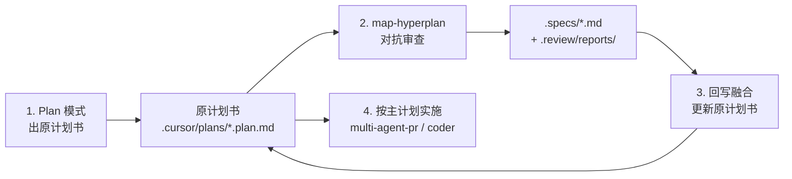

# Plan → Hyperplan 工作流

MAP 大型方案的标准两阶段流程：**先 Plan 出施工图，再 Hyperplan 做会审并回写主计划**。

## 顺序（不可颠倒）

| 阶段 | 工具 / 模式 | 产出 | 禁止 |
|------|-------------|------|------|
| **1. 规划** | Cursor **Plan 模式** | `.cursor/plans/{name}.plan.md`（施工主文档草稿） | 直接写实现代码 |
| **2. 会审** | `/map-hyperplan` | `.specs/{name}.md` + `.review/reports/debate-*.json` | merge/push；`coder` subagent |
| **3. 融合** | Commander 手动收尾 | **更新原计划书**（非另起炉灶） | 仅留 spec、不改 plan |
| **4. 实施** | extract plan Phase 1–N | 代码、install、CI | 跳过 accepted spec 中的 P0 契约 |

## 文档层级（融合后）

| 文档 | 角色 |
|------|------|
| `.cursor/plans/*.plan.md` | **唯一施工主计划**（含 hyperplan 修订） |
| `.specs/*.md` | 设计审计存档（`status: accepted`）；顶部应回指主 plan |
| `.review/reports/` | 审查记录（claims、debate、consensus） |

## Hyperplan 完成后必做（Commander checklist）

- [ ] 将 accepted spec 中的 P0/P1 修订**合并进**原计划书（工期、接口、安全契约、DoD、todos 状态）
- [ ] 在原 plan 顶部注明 hyperplan 来源与 spec 路径
- [ ] 在 `.specs/*.md` frontmatter 增加 `implementation_plan` 回指主 plan
- [ ] 清空 `.review/critic-queue.json` 或确认无 unresolved P0
- [ ] 确认 `config.active: false`（critic-queue 清空后 `advance_critic_queue` 会自动 teardown；手动清空时需自行设 `active: false`）
- [ ] **再**进入 Phase 1 代码实施（`multi-agent-pr` 或 coder；hyperplan 本身不写业务代码）

## 反模式（oh-my-cursor 项目曾发生）

1. Plan 出 extract plan → 直接 hyperplan → **只写** `.specs/`，**未回写** plan → 两份文档分叉
2. 用户预期「spec 融合进原计划」；实际 spec 与 plan 各说各话
3. **修复：** debate 结束后 Commander 必须执行「融合回写」步骤（见 [issue #1](https://github.com/tizerluo/oh-my-cursor/issues/1)）

## 触发词

- Plan 模式：用户描述大 scope、多 phase、架构决策
- Hyperplan：Plan 确认后，用户说「对抗审查」「hyperplan」「审 spec」

## 参考实例

- 原计划：oh-my-cursor MAP Extract（`.cursor/plans/oh-my-cursor_map_extract_*.plan.md`）
- Hyperplan spec：`.specs/oh-my-cursor.md`（accepted round 2）
- 融合结果：plan 已吸收 Secret trust contract、install allowlist、5–7 天工期、Phase 1 completed
