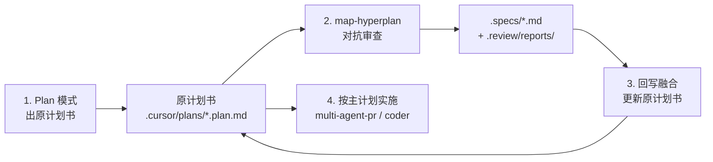

# Plan → Hyperplan 工作流

MAP 大型方案的标准两阶段流程：**先 Plan 出施工图，再 Hyperplan 做会审并回写主计划**。

## 顺序（不可颠倒）

| 阶段 | 工具 / 模式 | 产出 | 禁止 |
|------|-------------|------|------|
| **1. 规划** | Cursor **Plan 模式** | `.cursor/plans/{name}.plan.md`（施工主文档草稿） | 直接写实现代码 |
| **2. 会审** | `/map-hyperplan` | `.specs/{name}.md` + `.review/reports/debate-*.json` | merge/push；`coder` subagent |
| **3. 融合** | Commander 手动收尾 | **更新原计划书**（非另起炉灶） | 仅留 spec、不改 plan |
| **4. 实施** | extract plan Phase 1–N | 代码、install、CI | 跳过 accepted spec 中的 P0 契约 |

## 文档层级（融合后）

| 文档 | 角色 |
|------|------|
| `.cursor/plans/*.plan.md` | **唯一施工主计划**（含 hyperplan 修订） |
| `.specs/*.md` | 设计审计存档（`status: accepted`）；顶部应回指主 plan |
| `.review/reports/` | 审查记录（claims、debate、consensus） |

## Hyperplan 启动前（Configuration Gate）

与 [multi-agent-pr SKILL](../../skills/multi-agent-pr/SKILL.md) Step 0.5 一致：**Commander 必须先 AskQuestion，再写 config**。

1. AskQuestion 确认 workflow=`map-hyperplan`、critics 数量、debate rounds
2. 写入 `.review/config.json`（`active: true`, `workflow: map-hyperplan`）
3. 初始化 `.review/progress.json`（`phase: config-confirmed`）
4. **之后**才可 spawn critic subagents

Hook 行为（PR-4，`review_gate.py`）：

- `sessionStart`：检测到 hyperplan 触发词但无 `active` + `config-confirmed` 会话时，提示先跑 Configuration Gate
- 未确认 config 就 spawn subagent → 规划阶段违规（见反模式 §4）

## Debate 报告契约（accepted 门禁）

`advance-critic-queue` 在 critic-queue 清空、即将进入 `phase: accepted` 时，对 `map-hyperplan` 强制校验**最新** `.review/reports/debate-round-{N}.json`：

| 条件 | 结果 |
|------|------|
| 报告缺失 | `ok: false`，phase 不变 |
| `claims` 为空数组 | `ok: false`，`claims list must be non-empty` |
| 报告合法且 `claims` 非空 | 允许删除 queue、设置 `phase: accepted` |

因此：**不能**用空 debate JSON 或仅改 spec frontmatter 跳过真实辩论。每条 accepted 结论应能追溯到 `claims` / `evidence` / `consensus_items`。

Schema：`hooks/schemas/debate-round.schema.json`；校验：`validate_debate_report(..., require_nonempty_claims=True)`。

## Merge-back 清单（融合 P0/P1 进 plan）

Hyperplan `accepted` 后、进入 Phase 1 代码实施**之前**，Commander 必须完成以下融合（非可选存档步骤）。

### 输入源（按优先级）

1. **`.review/reports/debate-round-{N}.json`** — `claims`、`unresolved`（P0/P1）、`consensus_items`
2. **`.specs/{name}.md`**（`status: accepted`）— 修订后的契约、接口、DoD、工期
3. **已解决的 critic-queue 项** — 若 queue 已清空，对应修订应已反映在 spec + debate 中

### 融合步骤

- [ ] **P0 契约** — 将 debate/spec 中的 P0（安全、接口破坏性、数据迁移）写入 plan 对应 Phase；标为 blocking
- [ ] **P1 修订** — 将 P1（工期、可维护性、成本）并入 plan 估算、依赖、风险节
- [ ] **Todos / Phase 状态** — 更新 plan 内 phase checklist（如「Phase 1 completed」）；与 spec 一致
- [ ] **DoD / 测试计划** — 从 accepted spec 抄入或合并 plan 的验收标准
- [ ] **工期与范围** — 用 hyperplan 共识替换 plan 草稿中的过时估计
- [ ] **Plan 顶注** — 注明 hyperplan 轮次、spec 路径、融合日期
- [ ] **Spec frontmatter** — 增加 `implementation_plan: .cursor/plans/{name}.plan.md`（审计档回指主 plan）
- [ ] **Critic-queue** — 确认已清空或仅剩已接受的 deferred P2；无未解决 P0
- [ ] **Session 收尾** — 确认 `progress.phase: accepted`；`config.active: false`（PR-3 可在 queue 清空时自动 teardown）
- [ ] **再**进入 Phase 1 代码实施（hyperplan 本身不写业务代码；merge-back 在 active hyperplan 结束后进行，因 hook 仅允许写 `.specs/` + `.review/`）

### 融合后不变量

- **实施只跟 plan** — coder / multi-agent-pr 以 `.cursor/plans/*.plan.md` 为唯一施工图
- **Spec 只作审计** — `.specs/*.md` 保留辩论结论，不替代 plan 驱动实现
- **单源真相** — plan 与 spec 对同一 P0 契约不得矛盾；若有冲突，以 merge-back 后的 plan 为准

## Hyperplan 完成后必做（Commander checklist）

- [ ] 执行上文 **Merge-back 清单** 全部项
- [ ] 确认 `config.active: false`（critic-queue 清空后 `advance_critic_queue` 会自动 teardown；手动清空时需自行设 `active: false`）
- [ ] 然后才 `git push` 功能分支或启动 multi-agent-pr / coder

## 反模式（oh-my-cursor 项目曾发生）

1. Plan 出 extract plan → 直接 hyperplan → **只写** `.specs/`，**未回写** plan → 两份文档分叉
2. 用户预期「spec 融合进原计划」；实际 spec 与 plan 各说各话
3. **修复：** debate 结束后 Commander 必须执行「融合回写」步骤（见 [issue #1](https://github.com/tizerluo/oh-my-cursor/issues/1)）
4. **跳过 AskQuestion** — 未写 `config.json` / `phase: config-confirmed` 就 spawn critics；`sessionStart` 会提示，但 Commander 若无视则 session 无契约、成本与轮次失控
5. **Plan 内假 critics** — 在 plan 或 spec 中手写「安全组认为…」「架构组反对…」而未 spawn `architect` / `generalPurpose` critic subagents、未产出 `debate-round-*.json`；表面像会审，实际无对抗证据
6. **空 claims 冲 accepted** — 写 `{}` 或 `claims: []` 的 debate 报告后调用 `advance-critic-queue`；hook 拒绝（`claims list must be non-empty`），phase 卡在 revise

## 触发词

- Plan 模式：用户描述大 scope、多 phase、架构决策
- Hyperplan：Plan 确认后，用户说「对抗审查」「hyperplan」「审 spec」

## 参考实例

- 原计划：oh-my-cursor MAP Extract（`.cursor/plans/oh-my-cursor_map_extract_*.plan.md`）
- Hyperplan spec：`.specs/oh-my-cursor.md`（accepted round 2）
- 融合结果：plan 已吸收 Secret trust contract、install allowlist、5–7 天工期、Phase 1 completed

## 相关

- [map-hyperplan SKILL](../../skills/map-hyperplan/SKILL.md) — pipeline、debate JSON 模板
- [multi-agent-pr SKILL](../../skills/multi-agent-pr/SKILL.md) — Configuration Gate（AskQuestion）
- PR-4 hyperplan enforcement — debate claims required、`sessionStart` config gate
